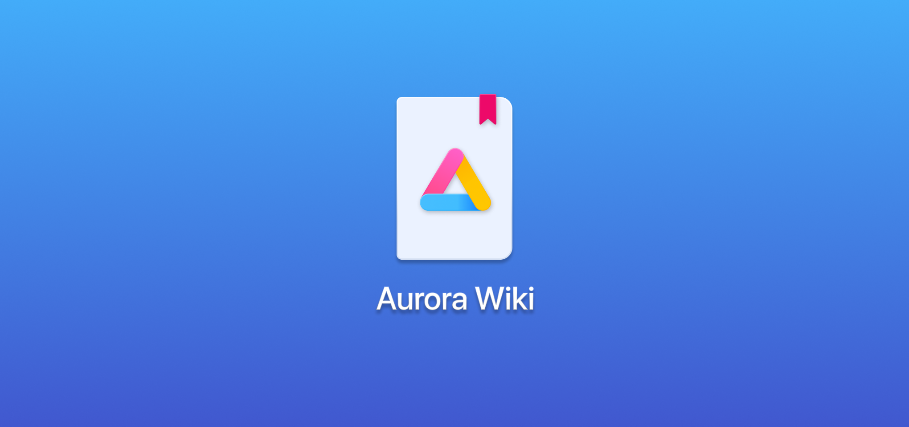

# Home

## **What is this page for?**

Because of some complications from our team regarding server usage, the website got taken down and we decided to make a backup location for our docs and faqs so that users would have somewhere to look other than asking on support chats like Telegram or GitLab Issues.

Long story short: Because Google's Play store disappoints with a lack of features; Play Store is also proven to be [spyware/malicious](https://www.gnu.org/proprietary/malware-google.html). Unfortunately, we cannot always get by with just FOSS apps, so _Aurora Store_ gives us the possibilty to retrieve apps from the Google Play repository without having to trouble you and your device with Google Apps.

If you're a newcomer or have any questions, please read Troubleshooting & FAQs before issuing problems on GitLab or asking for help in the Telegram support chat.

If you're interested in Aurora Store's future development and what has changed since, read the Roadmap to know more!​

Other than that, indulge yourself with a good helping of Wiki pages! :D
