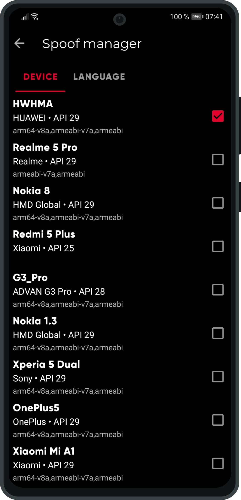
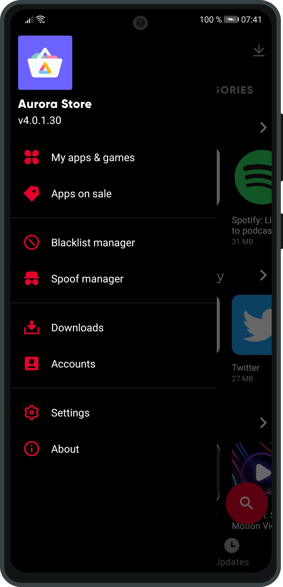
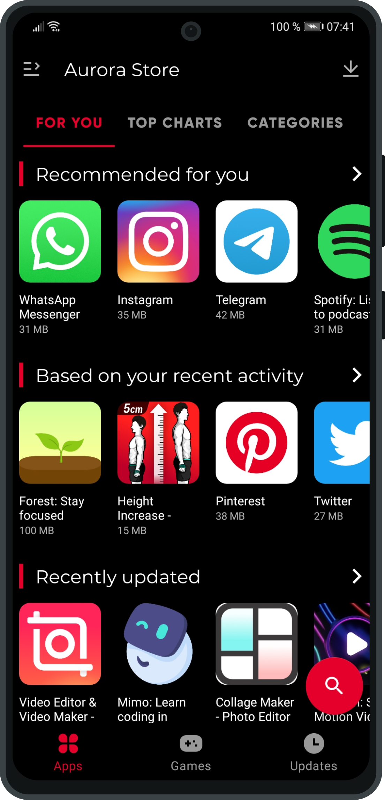
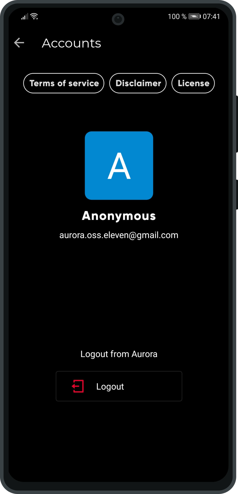

# Aurora Store

### About

Aurora Store is an open-source alternative Google Play Store frontend client with privacy and modern design in mind. Not only does Aurora Store download, update, and search for apps like the Play Store, it also empowers the user with a handful of useful features.

### Screenshots

   

### Features

* **Anonymous Login**: Login using our provided pseudo-accounts.
* **Google Login**: Login using your personal Google account to access paid apps and games.
* **Device spoofing**: Found an app unavailable for your device? Use our crowdsourced device configurations to spoof you device!
* **Filter F-Droid Apps**: For Open-Source enthusiasts who want to keep F-Droid signed apps seperate from Aurora Store, exclude them with the flick of a switch!
* **Blacklist Apps**: **** By blacklisting apps, selected apps will not be sent to Google for fetching  updates.

### Known Bugs

### Terms of Service

### Policy

### Disclaimer

### Support
