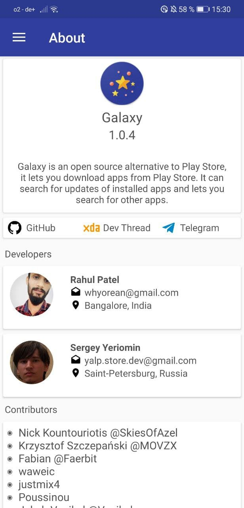
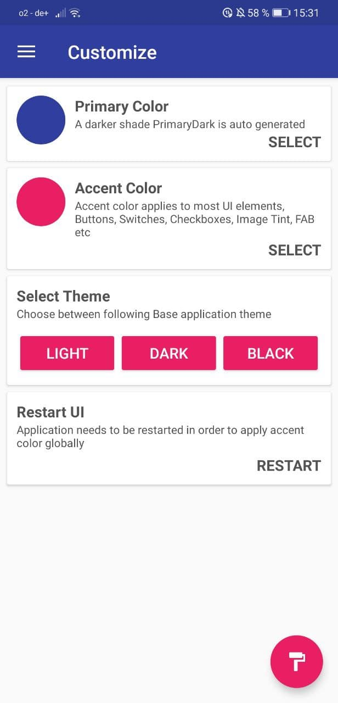
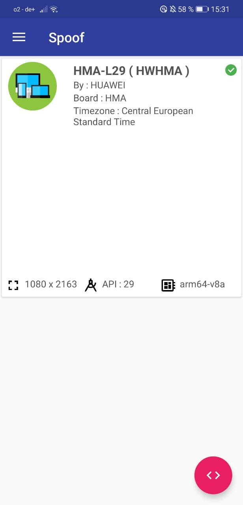
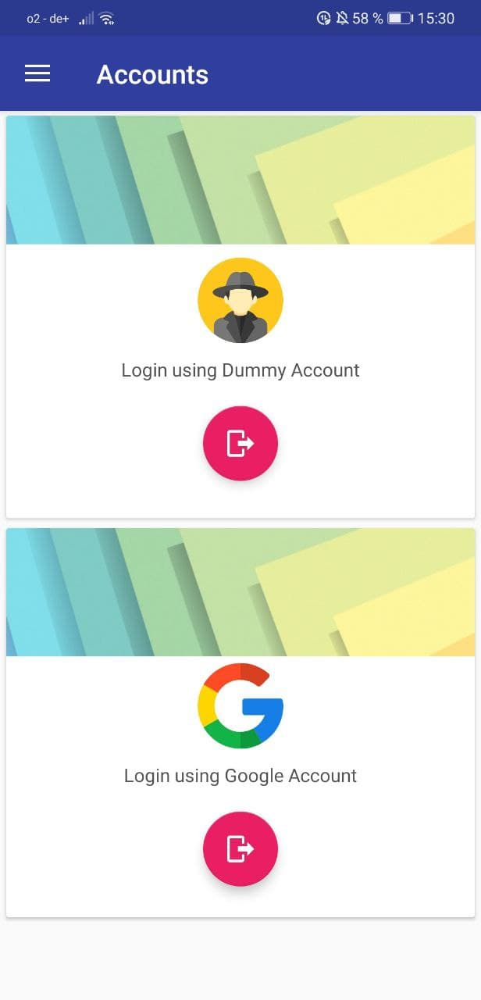
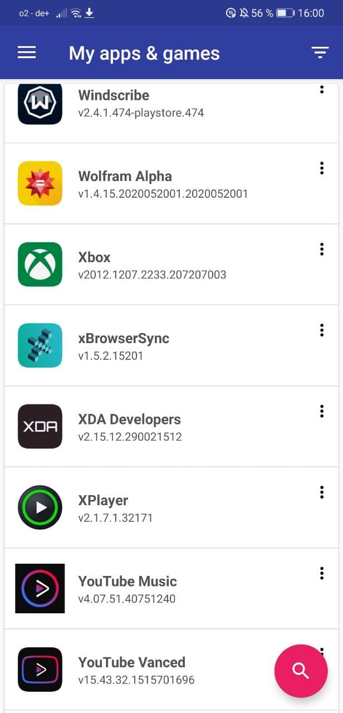
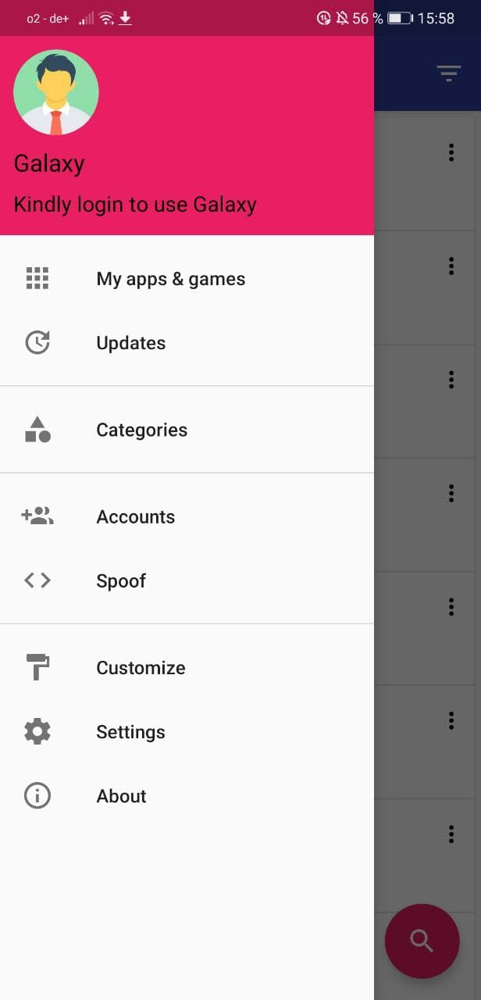

# version 1

**Legend:** ✅ = Completed​ | ⏳= Work In Progress​ |❓= Unknown Stage​​

### Screenshots

<figure><figcaption>
About Galaxy Store
</figcaption></figure>

 

<figure><figcaption>
Theming options
</figcaption></figure>

 

<figure><figcaption>
Device spoofing options
</figcaption></figure>

 

<figure><figcaption>
Login options
</figcaption></figure>

 

<figure><figcaption>
My apps &#x26; games 
</figcaption></figure>

 

<figure><figcaption>
Sidemenu
</figcaption></figure>

Aurora Store was formerly called the Galaxy Store (not to be mixed up with Samsung's Galaxy Store!). It was a fork of Yeriomin's YalpStore which included more features than YalpStore itself. These included:

### ✅ Device spoofing

Pretend to be a different device! With device spoofing, you can unlock apps which are only available to certain devices, e.g. Pixel Launcher for Pixel.

### ✅ Google & Anonymous sign-in

Anonymous sign-ins let you download and install apps from the Google Play Store without having to own a Google account. Google sign-ins let you download your paid apps.

### **✅ Delta updates**

Delta updates only download changes during updates, while normal updates will download the whole .apk file.
