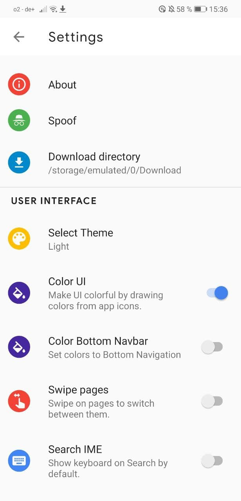

# version 2

**Legend:** ✅ = Completed​ | ⏳= Work In Progress​ |❓= Unknown Stage​​

### Screenshots

<figure><figcaption>
About page
</figcaption></figure>

 

<figure><figcaption>
Login options
</figcaption></figure>

 

<figure><figcaption>
Various settings
</figcaption></figure>

 

<figure><figcaption>
Spoof preferences
</figcaption></figure>

 

<figure><figcaption>
Main store page
</figcaption></figure>

We've rebranded our app with a new name - Aurora Store! It's a refresh of the old Galaxy Store with a new and pleasing UI, making it easier to navigate and giving users a better experience with a Google-like design. Other than that, more features have been added:

### ✅ Added Location spoofing to allow accessing Geo-restricted Apps​

Apps that are Geo-restricted like banking apps, library apps etc. can now be downloaded by spoofing your own location along with a VPN service! The boundaries are no more!

### ✅ Add Filter to exclude Non-Market, F-Droid & Guardian Project Apps​

Filter out apps that are downloaded from outside the Play Store / Google repository so that you don't get meaningless updates when updating your apps. F-Droid and some others will have their own keys and sign .apk files with a different signature, so installing/updating those apps through Aurora Store will not work.
