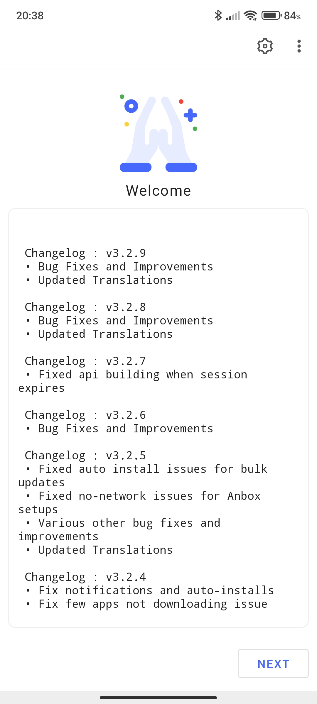
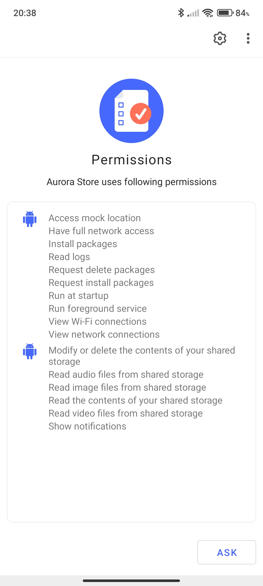
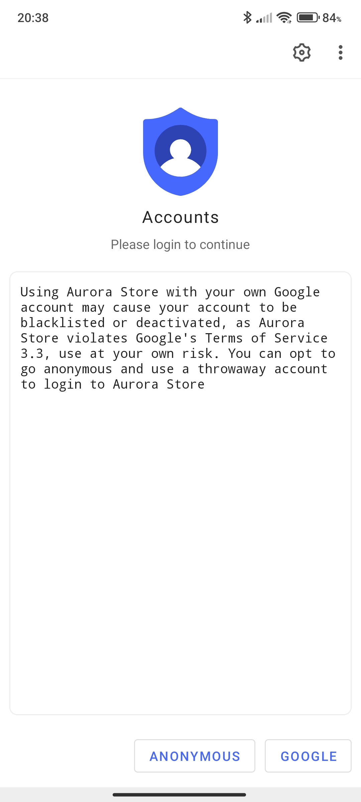
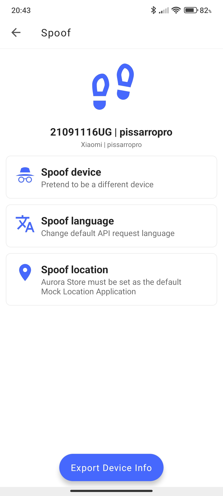
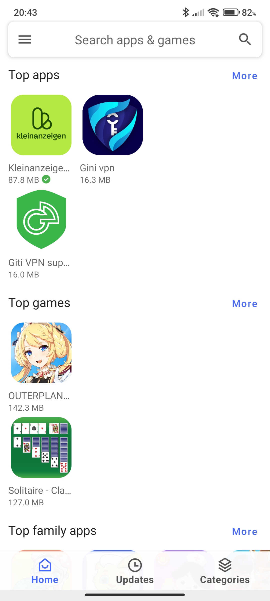
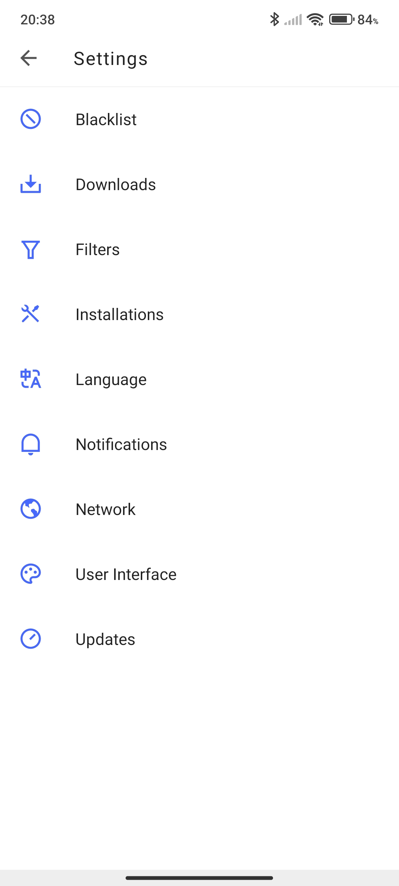

# version 3

**Legend:** ✅ = Completed​ | ⏳= Work In Progress​ |❓= Unknown Stage​​

### Screenshots

<figure><figcaption>
Changelog and welcome screen
</figcaption></figure>

 

<figure><figcaption>
Permission requests
</figcaption></figure>

 

<figure><figcaption>
Accounts page
</figcaption></figure>

 

<figure><figcaption>
Spoofing preferences
</figcaption></figure>

 

<figure><figcaption>
Main page
</figcaption></figure>

 

<figure><figcaption>
Settings page
</figcaption></figure>

### ✅ Add support for Aurora Services​

Aurora Services help install apps in the background.

### ✅ Add support for Split APKs​

Support for split apks are a great feat, allowing for more versatile downloads and storage optimizations.

### ✅ Add In-App Download Manager​

Download manager shows what downloads Aurora Store is currently doing.

### ✅ New UI based on latest MD Guidelines​

### ✅ Deploy dedicated token-dispenser​

### ✅ Add Favourite Apps Manager​

### ✅ Enforce proxy network on download requests​

### ✅ Add support for AndroidTV​

Now it is possible to use Aurora Store on AndroidTV.

### ✅ Add translations​

Translations from volunteers are added to help users worldwide with system navigation.

### ✅ Add option to use custom token dispensers (Settings > Network)​

One of the most important options added since

### ✅ Add option to install apps directly to work profile (only rooted users)​

For users with root access with a separate work profile (Isolated Storage) are now able to install apps directly through
