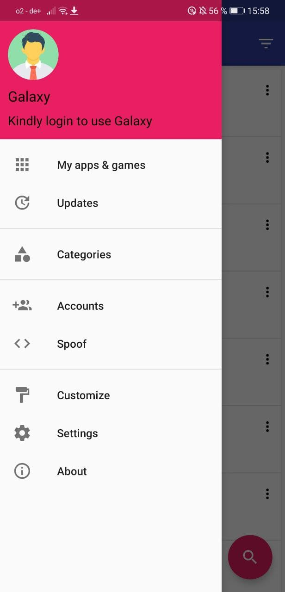
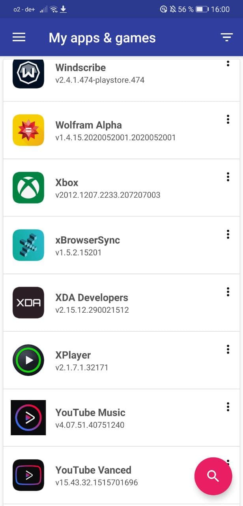
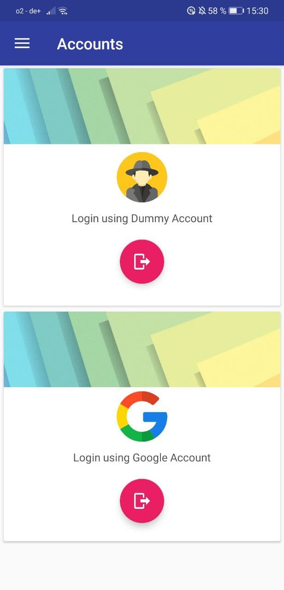
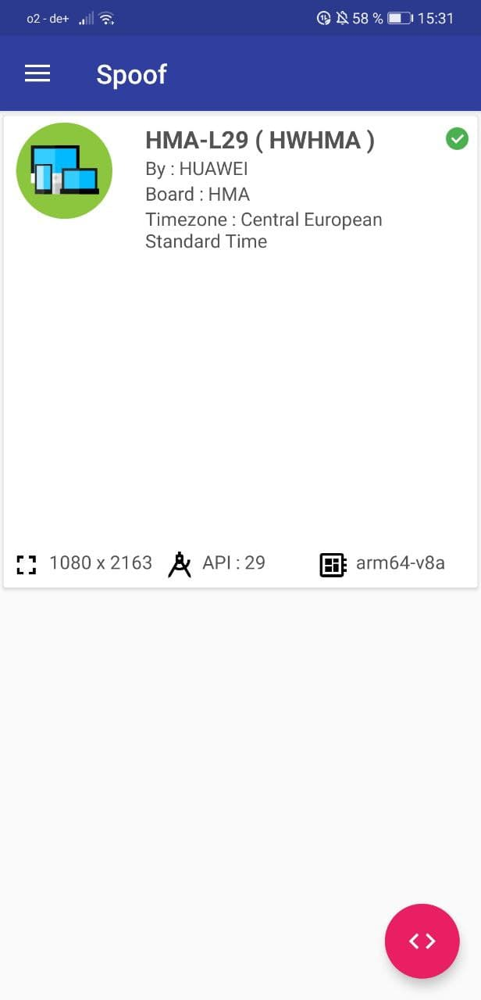
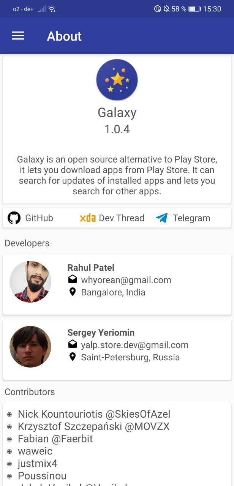

# version 1

Aurora Store was formerly called the Galaxy Store \(not to be mixed up with Samsung's Galaxy Store!\). It was a fork of Yeriomin's YalpStore which included more features than YalpStore itself. These included:

### ✅ Device spoofing

### ✅ Google & Anonymous sign-in

### **✅ Delta updates**

